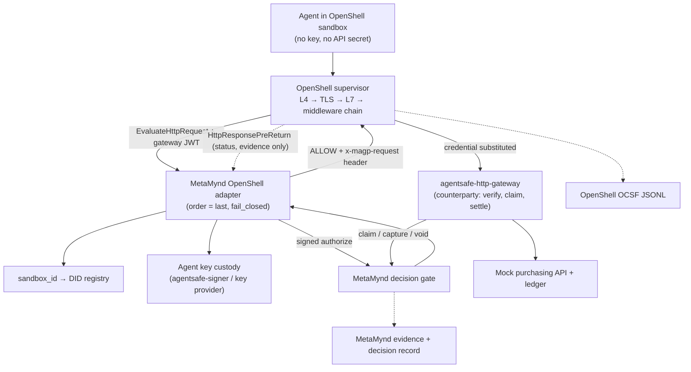

# MetaMynd × NVIDIA OpenShell: integration proof of concept

**Version:** 0.3 · 29 September 2026 (revises v0.2 of the same date)
**Purpose:** Establish technical fit and whether there is a credible product and collaboration path. This is a POC scope, not a claim of an existing partnership or completed integration.
**Verified against:** OpenShell `v0.1.2` (tag `6648bd0c`, 28 Sep 2026; supervisor-middleware proto unchanged at `main` `1358941b`) and MetaMynd/AgentSafe `main` `09422bc4`. Every claim marked *(verified)* was checked in source, not only in docs.

## What changed from v0.2

| v0.2 assumption | Finding | v0.3 decision |
| --- | --- | --- |
| The adapter attests the action with its own identity | MetaMynd's decision gate (`POST /api/v1/policy/mandate/authorize`) accepts **only** an Ed25519 signature by the key embedded in the agent's DID. There is no act-as, service-account or delegated-signer path *(verified)*. | The adapter **custodies each sandbox agent's key** outside the sandbox (via `agentsafe-signer` or a key-provider) and signs as that agent. The assurance claim changes accordingly (see Identity). |
| The adapter must build an HTTP-to-action mapper, canonicaliser and gateway from scratch | MetaMynd already ships `@metamynd/agentsafe-http-gateway` + `agentsafe-mcp-guard`: route→action pinning, strict JSON, field allow-lists, payload-digest binding, credential isolation, claim/settle, fail-closed codes. | Reuse them. The upstream purchasing API sits behind the existing gateway as the **settling counterparty**. The adapter only authorizes. |
| The middleware can settle the transaction outcome | OpenShell has a response hook (`HttpResponsePreReturn`, released in v0.1.2) that sees `status_code`. But it is **not called** when the upstream fails before a response head, on 101 upgrades or after a later-stage deny. No failure notification exists *(verified)*. | Settlement happens at the **system of record** (the purchasing service's MetaMynd gateway), not in the middleware. The response hook is used only for evidence. |
| "Do not permit a later middleware to rewrite governed fields" | Up to 10 stages. Later stages receive and may replace the body and headers after we allow. The order is policy-controlled and live-editable *(verified)*. | Run as the highest-`order` stage **and** bind the exact payload digest into the signed request. The counterparty refuses the claim if the bytes changed. Optionally enforce attachment with a gateway interceptor. |
| `sandbox_id` context must be trusted as given | `RequestContext` itself is unsigned. Calls carry a **gateway-signed EdDSA JWT** with `caller_kind=supervisor` and a `sandbox_id` claim taken from the authenticated supervisor session *(verified)*. | Require `jwt.sandbox_id == RequestContext.sandbox_id` on every call. |
| Originating process can inform the decision | `originating_process` is always unset in v0.1.2 *(verified)*. | Removed. Identity granularity is the sandbox. |
| Formal policy analysis can include the external PDP | OpenShell's prover returns `unsupported` whenever `network_middlewares` is present. | Prove the policy with the middleware block stripped, and report middleware coverage separately. |
| Local Docker on the dev laptop | The host is Windows 11 Home. OpenShell supports Windows only as WSL2 + Docker (**Experimental**). Native Windows (MXC) **rejects network middleware**. | Run everything in WSL2 Ubuntu. Kernel checks come first in WP0. |
| 5–8 engineering days | Middleware SDKs don't exist outside Rust. Hedera testnet is needed for MetaMynd. WSL2 is experimental. | **9–13 engineering days.** |

## Executive decision

Build a small procurement agent in each of two OpenShell sandboxes that call a mock purchasing API. Register a **MetaMynd OpenShell adapter** as an operator-run supervisor middleware attached to that API host. For every state-changing request, the adapter does the following:

1. Authenticates the call via the gateway JWT.
2. Resolves `sandbox_id` to an enrolled MetaMynd agent DID through a trusted registry.
3. Canonicalises the HTTP action.
4. Signs a MAGP request as that agent with a key it custodies outside the sandbox, binding the exact body digest.
5. Obtains a MetaMynd decision.
6. On allow, attaches the signed request and `authorizationId` as a header and returns `ALLOW`. On deny, returns `DENY` with a stable `reason_code`.

OpenShell injects the provider credential after the chain. The mock purchasing API sits behind MetaMynd's existing `agentsafe-http-gateway`. That gateway re-verifies the signature and payload binding, claims the hold as a registered counterparty, forwards, and captures or voids from the real outcome.

Two independent controls must both pass:
- **OpenShell** enforces containment and the egress path.
- **MetaMynd** enforces business authority, both at the adapter (pre-egress) and at the counterparty (pre-execution).

## Architecture

The order inside the supervisor, confirmed in `openshell-supervisor-network/src/l7/relay.rs`:
1. L4 policy and binary identity
2. SSRF / allowed-IP check
3. TLS termination
4. Host/authority consistency check
5. OPA L7 rules
6. **Request middleware chain**
7. Credential placeholder substitution
8. Upstream write
9. Response middleware

Middleware never sees `Authorization`, `Cookie`, `Host` or other protected headers, and cannot introduce credential placeholders.

## Components and authority

| Component | Job | Trust boundary |
| --- | --- | --- |
| Procurement agent | Sends `POST /purchase-requests` with a provider placeholder in `Authorization` | Untrusted, sandboxed. Holds no agent key, no API secret and no MetaMynd credential |
| OpenShell sandbox + supervisor | Kernel-level egress capture (seccomp broker, `network_mode=none`), DNS ownership, TLS termination, L7 rules, middleware chain, credential substitution | Supervisor outside the workload |
| MetaMynd OpenShell adapter | Verifies the gateway JWT; maps `sandbox_id`→DID; canonicalises; signs as the agent; calls the gate; returns allow or deny; logs `request_id`↔decision | Trusted service outside every sandbox. **It holds agent signing authority, so it is the most sensitive component** |
| Key custody | One `agentsafe-signer` daemon per agent DID, or a custom key provider keyed by DID | Reachable only by the adapter; never from a sandbox |
| MetaMynd decision gate | Verifies identity, mandate, Standards/SOPs, caps, revocation and containment; mints a hold | Authoritative business decision |
| `agentsafe-http-gateway` in front of the purchasing API | Re-verifies the signed request and payload digest, claims the hold as a registered counterparty DID, forwards, then captures, voids or marks unknown | Trusted and co-located with the system of record |
| Mock purchasing service | Executes the purchase and records the ledger with idempotency key = `authorizationId` | Reachable only through the inspected host; refuses WebSocket upgrades; never echoes credentials |
| Evidence collector | Joins OpenShell OCSF, adapter log, MetaMynd decision record and ledger | Separate sink with minimal sensitive payload |

## Identity and binding

- **What MetaMynd verifies.** A request signed by the agent DID's key. Because the adapter signs, the precise claim is: *"the OpenShell supervisor observed this exact request leaving sandbox `S`, and the operator-bound agent for `S` is authorized for it."* It is **not** proof the agent intended it. The report must state this.
- **Binding source of truth.** A server-side registry written only by a trusted operator step. It maps `sandbox_id` (gateway-generated UUIDv4) → `{agentDid, mandate ref, key handle, binding generation}`.
  - The DID may also be written to a sandbox **annotation** (labels are too short, 63 characters, and disallow `:`), but only as a convenience copy.
  - Never use sandbox names (reusable), request headers or body, or prompts as identity.
- **Per-call authentication.** Pin the gateway's Ed25519 key or JWKS and `iss=openshell-gateway:<id>`, then check:
  - `typ=openshell-ext+jwt`
  - exact `aud`
  - `exp`
  - `caller_kind=supervisor`
  - `jwt.sandbox_id == RequestContext.sandbox_id`

  Tokens are reused bearer tokens (≤1 h), so do not reject a repeated `jti`.
- **Lifecycle.**
  - `sandbox_id` survives stop/start and restart. Delete-and-recreate yields a new UUID even under a reused name, and that new UUID gets no binding.
  - OpenShell has **no fleet-wide watch and no get-by-id RPC**. The revocation watcher polls `ListSandboxes` (label selector) and holds a `WatchSandbox` stream per sandbox. It treats `DELETING`, a stream end or `NOT_FOUND` as revocation.
  - On revocation, contain the agent in MetaMynd (`POST /agent-identity/:ref/contain`) or revoke its mandate. MetaMynd's gate reads live state, so revocation is immediate there.
- **One agent per sandbox.** OpenShell has no per-agent identity inside a sandbox.

## POC scenario and rules

- **Organisation and API.** A fictional organisation and one purchasing API, `POST /purchase-requests`.
- **Agents.** Two enrolled agents in separate sandboxes, served by the **same adapter instance**:
  - **Agent A.** MetaMynd mandate with scope `office_supplies.purchase`, `currency: "MYR"`, `perTxnMax: 500`, `maxAmount: 2000` (`perTxnMax` only takes effect when `maxAmount` is set) and `merchants: ["OfficeMart"]` (case-sensitive).
  - **Agent B.** A mandate for the same scope but a different merchant (`PaperCo`) and `perTxnMax: 200`.

  This replaces v0.2's "no mandate" agent: the stronger test is that the same request gets opposite verdicts depending on the sandbox.
- **Reviewer.** One human principal is the accountable reviewer, reached through MetaMynd escalation.
- **Rule authoring.** No MetaMynd code change is needed. Category is modelled as the mandate action, because MetaMynd has no native category field.
- **Expected reason codes** (record what is actually returned; don't depend on evaluation order):

| Case | Code |
| --- | --- |
| Over the per-transaction cap | `SPEND_LIMIT_EXCEEDED` |
| Lost race for the cap | `CAP_EXCEEDED` |
| Wrong merchant | `MERCHANT_NOT_ALLOWED` |
| Wrong action | `NO_PERMISSION_FOR_ACTION` |
| No mandate | `NO_MANDATE` |
| Revoked mandate | `MANDATE_REVOKED` |
| Contained agent | `AGENT_SUSPENDED` |

- **Mapping to OpenShell `reason_code`.** Codes must match `^[a-z][a-z0-9_]{0,63}$`, so each maps as `metamynd_<lowercased code>`. Adapter failures map to `metamynd_unavailable`, `metamynd_binding_unknown` and `metamynd_request_rejected`.
- **Canonicalisation (adapter).**
  - Method, host and path pinned per route. Reject anything unrouted (deny-by-default).
  - Parse with the gateway's strict JSON parser. It rejects duplicate keys, integers ≥2^53, more than 15 significant digits and nesting deeper than 64.
  - Apply the `allowedFields` allow-list and require a canonical decimal amount and a currency.
  - **Reject any request `Content-Encoding`.** OpenShell passes compressed bodies through raw.
  - Reject bodies over the registration's `max_payload_bytes` (≤4 MiB).
  - Bind the exact body bytes via `payloadDigest` + `payloadSignature`.
- **Context and trace.** Put `sandbox_id` in `trace.workflowId` and the OpenShell `request_id` in `trace.parentActionId`, both covered by `envelopeSignature`.

## Work packages

### 0. Platform and seam validation (1.5–2 days)

- **WSL2 host.**
  - Ubuntu 24.04 with systemd enabled.
  - Run `wsl --update`, then verify kernel ≥6.2 with Landlock in `/sys/kernel/security/lsm`. OpenShell refuses to launch sandboxes without Landlock ABI 3 and the required seccomp features.
  - Docker ≥28 (Docker Desktop with WSL integration, or Engine inside the distro).
- **Pin versions.** OpenShell `v0.1.2` CLI, gateway, supervisor image and proto revision, plus AgentSafe commit and package versions. Archive the configuration with the results.
- **MetaMynd backend.** Run it locally with a Hedera **testnet** operator (mandate issuance needs HCS; there is no global mock).
  - Set `VERIFICATION_STANDARD=manual`, or `BETA_AUTO_VERIFY=1`.
  - Set `EVIDENCE_ANCHOR_MODE=sync` + `EVIDENCE_ANCHOR=none` if anchoring is to be skipped. Batch mode always calls Hedera.
- **Unmodified sandbox check.** Show read allowed and write denied, with **`enforcement: enforce` set explicitly** (the default is `audit`).
- **Minimal Node gRPC middleware.** Generate stubs from `proto/supervisor_middleware.proto` and `proto/extension.proto`; there is no non-Rust SDK.
  - `Describe` with `PeerMetadata` negotiation and `expected_audience`.
  - Serve TLS from a private CA (`tls_ca_cert_path`).
  - Configure `[gateway_jwt]`.
  - Verify the JWT.
  - Deny one request.
  - **Never** use `allow_insecure_transport` beyond the first smoke test.
- **Exit criterion:** a denied mock POST leaves no ledger write, and the `HttpActivity` OCSF event shows `middleware_denied:<key>:<reason_code>`.
  - If the WSL2 kernel fails, the fallback is a Linux VM or cloud host, not native Windows.

### 1. MetaMynd baseline and fixtures (1–1.5 days)

- **Fixtures.** Clone `backend/scripts/demo-mandate.ts` to enrol:
  - two BYOK agents (keys generated in each `agentsafe-signer` daemon; `verify-key` proves possession);
  - principal, mandates, one SOP, and an escalation rule over RM300 for agent A (to exercise human review).
  - Register the purchasing gateway's service DID as a trusted counterparty for the owner, and set `MANDATE_REQUIRE_COUNTERPARTY_AUTH=true`.
- **Native baseline.** Put the mock purchasing API behind `agentsafe-http-gateway` with:
  - `requireAuthorization: true`
  - `requirePayloadBinding: true`
  - `requireContextSignature: true`
  - `denyByDefault: true`
  - a pinned `policyPublicKey`

  Drive it with a plain `agentsafe-guard` client (no OpenShell), and capture allow, deny, hold, claim, capture and the evidence IDs.
- **Decision contract (freeze).**
  - **Request:** `action, amount, currency, merchant, resource, nonce, issuedAt, signature, envelopeSignature, payloadDigest, payloadSignature, trace`.
  - **Response:** `decision, reasonCode, authorizationId, eventId, envelopeId, expiresAt, escalationId, passport`.

### 2. OpenShell adapter (3–4 days)

- **Registration.**
  - Implement `SupervisorMiddleware.{Describe, ValidateConfig, EvaluateHttpRequest}`; return `UNIMPLEMENTED` for WebSocket.
  - Implement `HttpResponsePreReturn.Evaluate` on the same endpoint.
  - Register the service once in the gateway TOML.
  - Attach it in each sandbox policy with `order` higher than any other stage, `on_error: fail_closed` and `endpoints.include: [<purchasing host>]`.
  - Set `timeout` for a round-trip to the gate. The default is 500 ms; measure it, and expect 1–3 s.
- **Per request:**
  1. Verify the JWT and context.
  2. Look up the binding; an unknown or stale binding is denied.
  3. Canonicalise.
  4. Call `buildSignedRequest(...)` with a key provider selected by DID, then `POST /policy/mandate/authorize`. Treat any non-200, a timeout, or a missing verdict shape as deny.
  5. On allow, add the header `x-magp-request: {…signed, authorizationId}` and return `ALLOW`.
  6. Log `{request_id, sandbox_id, agentDid, nonce, authorizationId, eventId, decision, reasonCode}`.
- **Response hook.** `HEADERS_ONLY` preflight, record `status_code` against `request_id`, then return skip. **Evidence only; never the settlement path.**
- **Concurrency test.** Two sandboxes and concurrent requests against one adapter instance. Show there is no shared mutable state other than the registry.
- **Credentials.**
  - Create the provider for the purchasing API. The agent sends `Authorization: Bearer <placeholder>` and OpenShell substitutes it after the chain.
  - Verify that the adapter never sees the secret, that the sandbox environment contains only the placeholder, and that the API does not echo it back (OpenShell does not scrub responses).
- **Escalation (stretch).**
  - The adapter returns deny `metamynd_escalation_pending` and records `(sandbox_id, payloadDigest) → escalationId`.
  - After approval, an identical retry from the same sandbox consumes the approved `authorizationId` instead of re-authorizing.
- **Policy integrity (stretch).** Add a gateway interceptor on `CreateSandbox`/`UpdateConfig`. It requires the adapter's entry with the maximum `order` and `fail_closed`, and rejects `tls: skip`, `protocol: tcp` or hostless `allowed_ips` rules that reach the purchasing API's address.

### 3. Adversarial and reliability matrix (2 days)

Run each case twice: (a) with the counterparty gateway enforcing, and (b) with the counterparty gateway set to verify-only. Run (b) proves that OpenShell and the adapter alone block the action.

| Case | Expected result | Proof |
| --- | --- | --- |
| A: RM100 OfficeMart | One write, one allow, hold captured | Ledger row keyed by `authorizationId`; adapter log ↔ decision record ↔ OCSF |
| A: RM600, or merchant PaperCo | Denied pre-egress | No ledger row; `metamynd_spend_limit_exceeded` / `metamynd_merchant_not_allowed` |
| B: same RM100 OfficeMart request as A | Denied; A's identical request allowed | Different DIDs and decision IDs for the same body |
| Concurrent A+B, and concurrent A near the cap | Each judged on its own mandate; the cap is never exceeded | `CAP_EXCEEDED` on the losing request; ledger total ≤ cap |
| A: RM350 | Escalated; no write until approval | Escalation record; no ledger row before approval |
| Sandbox deleted and recreated under the same name | New UUID has no binding | `metamynd_binding_unknown`; watcher revocation event |
| Mandate revoked or agent contained mid-session | Next request denied | Timestamps of revoke vs denial (gate is live; bundle ≤10 min is not used) |
| Forged DID or mandate in body or headers | Ignored; identity comes from `sandbox_id` | Denied or unchanged verdict; no side effect |
| curl, Python client, generated script, alternate tool | Same control | OCSF shows the same middleware decision |
| Literal IP, alternate hostname, other port, `http://` | Blocked at L4, or reported as uncovered | OCSF `CONNECT denied`; no ledger row |
| `Upgrade: websocket` on an allowed GET | API refuses the upgrade (OpenShell passes 101 through raw) | Documented as an API-side requirement |
| gzip request body; body over the limit | Denied | `metamynd_request_rejected` / OpenShell size denial |
| Later middleware stage mutates the body after allow (test stage) | Counterparty refuses the claim | `PAYLOAD_DIGEST_MISMATCH`; no ledger row |
| Adapter down, slow (> timeout) or malformed reply | 403 `middleware_failed`; no write | OCSF `openshell.middleware.failure` High |
| MetaMynd gate down | Adapter denies | `metamynd_unavailable` |
| Upstream failure after allow | No response event; hold resolved by the counterparty (void/unknown) | Hold state; no double charge on agent retry (new nonce → new hold; old one voided or lapses in 15 min) |
| Replay of a captured `x-magp-request` header | Refused | `AUTHORIZATION_ALREADY_CLAIMED` |

**Coverage statement.** One inspected HTTPS host proves exactly that host. The report must list these uninspected paths:
- `tls: skip` and `protocol: tcp`;
- WebSocket binary frames and server-to-client messages;
- 101 passthrough;
- compressed bodies (rejected);
- IP-level reachability through other policy rules;
- the prover's `unsupported` result.

### 4. Evidence and assessment (1–1.5 days)

- **Joins.**
  - OpenShell OCSF (`container.uid` = `sandbox_id`, host, path, time, `status_detail`) → adapter log (`request_id`) → MetaMynd `decision_record` (`trace.parentActionId`, `envelope_id`) → `evidence_event` (`decision_digest`) → Merkle proof → ledger (`authorizationId`).
  - OpenShell OCSF carries **no `request_id`**, so the adapter log is the bridge. Say so.
- **Latency.** p50/p95/p99 for:
  - OpenShell with no middleware;
  - native MetaMynd gateway only;
  - combined path.

  Use ≥100 calls each on a stable WSL2 host. Record timeouts, false allows, and the MetaMynd authorize share of the latency.
- **Integration report.** Reproducible setup, versions, demo video, findings, limitations, upstream questions and a recommendation.

## Acceptance gates

**Technical pass**
- Every intended allowed call executes exactly once, with zero unauthorized ledger writes in both matrix runs.
- Tested outages fail closed.
- Two DIDs through one adapter with opposite verdicts for identical requests.
- JWT-verified sandbox binding with a working revocation watcher.
- A correlated trail from OCSF to ledger.
- No upstream secret in the sandbox or the adapter.
- No agent key reachable from a sandbox.
- No fork of OpenShell or MetaMynd, on pinned releases.

**Product pass**
- Show a business authorization OpenShell alone cannot express: live mandate, merchant and spend cap across requests, revocation, human escalation and a named accountable principal.
- Show an OpenShell control MetaMynd alone cannot provide: kernel-level egress capture regardless of client, and secret isolation.
- Show both decisions in one trace.

**Collaboration pass**
- A public-safe example with synthetic data.
- Documented use of supported extension points only.
- Measured latency.
- Concrete, issue-template-ready feature requests (below).
- Joint positioning explored only after the technical pass. NVIDIA participation, endorsement and distribution are not assumed. OpenShell is Apache-2.0 with no trademark grant; don't use NVIDIA marks as a badge.

**No-go / revise**
- The agent reaches the purchasing API without the middleware under a hygienic policy.
- Ambiguous sandbox-to-DID binding.
- An approved request is executed with different bytes.
- The middleware API breaks within the POC window with no migration path.
- Adapter latency is incompatible with a sensible `timeout`.

## Upstream feature requests and questions (OpenShell)

Raise these through the feature-request template after the prototype works. External contributors need to be vouched first.

1. **Settlement signal.** A notification-only `HttpResponse/completed` hook (RFC 0009 lists it as future work) that fires on upstream failure too, with `request_id` and status or error class.
2. **Correlation.** Include `request_id` in middleware OCSF events.
3. **Chain integrity.** A way for an operator to pin a middleware as the final, immutable stage, or to mark governed fields read-only for later stages.
4. **Identity.** Stable per-agent or workload identity when a sandbox hosts several agents. `originating_process` population.
5. **Lifecycle.** A fleet-wide sandbox watch and a get-by-id RPC for binding revocation.
6. **Transport.** mTLS or channel-bound tokens for middleware calls (the current bearer JWT is replayable until `exp`).
7. **Stability.** Timeline for moving `openshell.middleware.v1` from research preview to the RFC 0014 stable contract, and for the phase-2 removal of plaintext and `fail_open`.
8. **Prover.** Modelling of an external PDP as an opaque, fail-closed gate, so middleware-bearing policies aren't `unsupported`.

## MetaMynd-side follow-ups (not needed for the POC path)

- An `agentsafe-http-gateway` split into `decide()` / `complete(status)` plus host-aware route matching, if a future design settles in the middleware instead of at the counterparty.
- An indexed external-correlation column on `decision_record` and a query API. IDs in the GovernanceEvent/OTel stream.
- A formal assurance tier for "supervisor-custodied agent key" versus "agent-held key" in MetaMynd's identity model and evidence.

## Estimated effort and ownership

About **9–13 engineering days** for one engineer familiar with MetaMynd, plus a short independent threat review of the matrix.

**Prerequisites:**
- AgentSafe repo access.
- A Hedera testnet operator account.
- A Windows 11 host with WSL2 (or a Linux VM or cloud host as the fallback).
- Docker ≥28.

No NVIDIA GPU, production API or live spending is required. Kubernetes/hosted operation (which needs a NetworkPolicy-enforcing CNI) is a later phase.

## Source notes (checked 29 September 2026)

**OpenShell** (`github.com/NVIDIA/OpenShell`, tag `v0.1.2`):
- `proto/supervisor_middleware.proto`, `proto/extension.proto`
- `crates/openshell-supervisor-middleware/src/{lib.rs, response.rs}`
- `crates/openshell-supervisor-network/src/l7/{relay.rs, middleware.rs, rest/http_response.rs}`, `src/proxy.rs`
- `crates/openshell-extension-core/src/jwt.rs`, `crates/openshell-server/src/auth/sandbox_jwt.rs`, `grpc/auth_rpc.rs`
- `crates/openshell-sandbox/src/network_broker.rs`, `crates/openshell-prover/src/containment.rs`
- `docs/extensibility/supervisor-middleware/{index,configure,operations}.mdx`, `docs/how-it-works/policies/{network-rules,schema}.mdx`, `docs/about/support-matrix.mdx`
- `rfc/0009-supervisor-middleware`, `rfc/0013-native-windows-mxc`, `rfc/0014-release-stability`
- `examples/supervisor-middleware-content-guard`, `examples/governance-interceptor`

**MetaMynd/AgentSafe** (`main` `09422bc4`):
- `backend/src/features/policy/mandate/{mandate.controller.ts, mandate.service.ts, counterparty-auth.ts}`
- `backend/src/policy-core/canonical.ts`, `backend/src/features/magp/reason-codes.ts`
- `integrations/agentsafe-http-gateway/gateway.mjs`, `integrations/agentsafe-mcp-guard`, `integrations/agentsafe-guard/agentsafe-guard.mjs`, `integrations/agentsafe-signer`
- `backend/scripts/demo-mandate.ts`, `docs/design/metamynd-agentic-governance-protocol.md`

Some OpenShell docs and examples in the repository still describe an earlier netns/nftables egress model (RFC 0005, `examples/private-ip-routing`). They were not relied on.
