# Build plan: MetaMynd OpenShell adapter POC

**Status:** Draft 1 · 29 September 2026
**Inputs:** [design.md](design.md) and [POC scope v0.3](../MetaMynd_OpenShell_Integration_POC_Scope_v0.3.md)
**Effort:** 9–13 engineering days for one engineer, plus a half-day independent threat review.

Every milestone is one or more PRs into `main`. Each PR must pass CI (lint, unit and contract tests) and leave the tree clean. Milestone exit criteria are demonstrable, and each is recorded in `docs/report/runs/<milestone>.md` with command output.

## Milestone overview

```mermaid
gantt
  dateFormat  X
  axisFormat  day %s
  section Platform
  M0 Platform & seam spikes        :m0, 0, 2
  section MetaMynd
  M1 Fixtures & native baseline    :m1, after m0, 1.5
  section Adapter
  M2 Adapter core (deny path)      :m2, after m0, 2
  M3 Allow path & end-to-end       :m3, after m1 m2, 2
  section Hardening
  M4 Lifecycle, stretch, matrix    :m4, after m3, 2.5
  M5 Evidence, perf, report        :m5, after m4, 1.5
```

M1 and M2 can overlap after M0. The critical path is M0 → M2 → M3 → M4 → M5.

## M0: platform and seam spikes (1.5–2 days)

**Goal:** prove the platform can host the POC and resolve spikes S1–S3 and S5 before writing product code.

| # | Task | Output |
| --- | --- | --- |
| 0.1 | Monorepo skeleton: npm workspaces, Node 22, `node:test`, `tsc --checkJs`, lint, CI workflow, `versions.lock` | PR `chore: scaffold` |
| 0.2 | WSL2 host: Ubuntu 24.04, systemd, `wsl --update`. Record `uname -r` and `/sys/kernel/security/lsm` (S1). Install Docker ≥28 | `docs/runbook.md` §host |
| 0.3 | Install OpenShell `v0.1.2` pinned. `openshell status`. Create a throwaway sandbox with `enforcement: enforce`. Show GET allowed and POST denied by L7 | run log |
| 0.4 | Vendor `proto/v0.1.2/{supervisor_middleware,extension}.proto`. Generate the loader. Write a **stub middleware** (TLS with a private CA, JWT verify, always `DENY stub_deny`). Register it in `gateway.toml`, attach it to a test host, and observe the 403 and the OCSF `middleware_denied:…:stub_deny` (S2) | PR `feat(adapter): stub deny middleware` |
| 0.5 | Purchasing upstream reachability and TLS trust: try a derived supervisor image with the POC CA. Fall back to plain HTTP (S3) | decision recorded in `design.md` §11 |
| 0.6 | Bring up the MetaMynd backend locally (compose, Hedera testnet operator, `VERIFICATION_STANDARD=manual`, sync anchoring off). Time 20 signed authorize calls with `demo-mandate.ts` (S5) | latency numbers; timeout decision |

**Exit:** the stub middleware denies a real sandbox request, the OCSF event is captured, and S1, S2, S3 and S5 are closed or have their fallback chosen. **If S1 fails,** stop and re-host on a Linux VM before continuing (add about 0.5 day).

## M1: MetaMynd fixtures and native baseline (1–1.5 days)

**Goal:** a reproducible MetaMynd tenant and a working native (non-OpenShell) purchase path.

| # | Task | Output |
| --- | --- | --- |
| 1.1 | `packages/mock-purchasing`: Fastify, SQLite ledger with an idempotency key, refuses `Upgrade`, never echoes headers. Unit tests | PR |
| 1.2 | `packages/purchasing-gateway`: wrapper over `agentsafe-http-gateway` + `agentsafe-mcp-guard`, with the strict options from design §3.5, the bearer-token check, and the service identity | PR |
| 1.3 | `tools/enrol`: principal (manual KYB), two signer daemons with `generate-key`, BYOK agents A and B with `verify-key`, the mandates (A: OfficeMart, cap RM500 per transaction, RM2000 total; B: PaperCo, cap RM200), a SOP escalation over RM300 for A, and counterparty registration. Idempotent; writes `state/enrolment.json` | PR |
| 1.4 | Native baseline: a script using `agentsafe-guard` directly (no OpenShell) that runs allow, deny and cap cases through the purchasing gateway and shows hold → claim → capture | run log `m1-native.md` |
| 1.5 | Freeze the decision contract in `docs/design.md` §4 (any deltas found in 1.4) and close S4 | PR `docs:` |

**Exit:** the native baseline shows allow (ledger row + captured hold), `SPEND_LIMIT_EXCEEDED`, `MERCHANT_NOT_ALLOWED` and `CAP_EXCEEDED` under concurrency. The same run shows the purchasing gateway refusing a request with no `x-magp-request`.

## M2: adapter core, deny path first (2 days)

**Goal:** a production-shaped adapter that can only ever deny, fully tested, before any allow path exists.

| # | Task | Output |
| --- | --- | --- |
| 2.1 | `server` + `describe`: manifest, `PeerMetadata` negotiation, `expected_audience`, two bindings, limits | PR + contract tests |
| 2.2 | `auth`: JWT verifier with pinned key and gateway ID, plus the vector tests from design §6.1 | PR |
| 2.3 | `config` (`ValidateConfig` strict schema) and `route` (host-aware matcher, deny-by-default) | PR |
| 2.4 | `packages/registry`: schema, atomic write, lock, reload-on-change, last-good fallback. CLI `bind` / `unbind` / `list` | PR |
| 2.5 | `canon`: encoding, content-type and size checks, strict JSON, field rules. Port the gateway fuzz corpus | PR |
| 2.6 | `decide` + reason mapping + `journal`. Exhaustiveness test: every error class maps to `DENY` with a valid regex code | PR |

**Exit:** deployed against the real OpenShell. Every request to the purchasing host is denied with the correct code for each of: unknown binding, wrong route, gzip body, oversize body, bad JSON and a forged sandbox in the context (a JWT mismatch, exercised in the contract tests). The journal records every decision.

## M3: allow path and end-to-end purchase (2 days)

**Goal:** a governed purchase from inside a sandbox executes exactly once.

| # | Task | Output |
| --- | --- | --- |
| 3.1 | `signer`: guard-per-binding cache with a daemon key provider; `buildSignedRequest` with the payload, trace (`workflowId=sandbox_id`, `parentActionId=request_id`) and context signature | PR |
| 3.2 | `gate`: authorize call with a deadline, verdict classification, a fail-closed matrix of tests against a fake gate (timeouts, 500, malformed, 403 codes) | PR |
| 3.3 | `x-magp-request` header mutation on permit; `response` hook recording `status_code` | PR |
| 3.4 | `agent/` image (Python, deterministic scenarios) plus the provider profile `purchasing-api` and the sandbox policy from design §4.2. Create sandboxes A and B with the `metamynd.io/managed` label and a DID annotation. Bind them with the registry CLI | PR + runbook |
| 3.5 | End-to-end: A buys RM100 at OfficeMart → 201. Ledger row, captured hold, journal allow + response 201 | run log `m3-e2e.md` |
| 3.6 | Two-sandbox isolation: B sends the identical request → `metamynd_merchant_not_allowed`. Concurrent A+B load (50 requests each) shows no cross-attribution | run log |

**Exit:** scope acceptance items "intended calls execute once", "two identities through one adapter" and "no secret in the sandbox or adapter" are demonstrated. For the secret check, run `env` and `/proc` greps inside the sandbox, and grep the adapter journal and logs.

## M4: lifecycle, stretch features and the adversarial matrix (2–2.5 days)

| # | Task | Output |
| --- | --- | --- |
| 4.1 | `packages/watcher`: `ListSandboxes` poll + per-sandbox `WatchSandbox`, revocation on delete or id change, optional MetaMynd contain | PR |
| 4.2 | `tools/policy-lint`: fetch the effective policy (`openshell policy get --full`). Fail on `tls: skip`, `protocol: tcp`, hostless `allowed_ips` or literal-IP rules reaching the purchasing gateway, any stage with `order` ≥ the adapter's, `fail_open`, or `enforcement: audit` | PR |
| 4.3 | Orphan-hold sweeper: void unclaimed holds older than 60 s using the agent's guard | PR |
| 4.4 | (Stretch) escalation approve-then-retry (design §5.4). Includes the nonce check with the purchasing gateway | PR or a documented deferral |
| 4.5 | (Stretch) gateway interceptor that enforces the adapter entry, its `order` and `fail_closed` on `CreateSandbox`/`UpdateConfig` | PR or a documented deferral |
| 4.6 | `tools/matrix`: script every row of scope v0.3 §3. Run twice: purchasing gateway enforcing, then verify-only. Include a deliberately inserted test middleware at a higher order to prove the body-mutation → claim-refusal path | run logs `m4-matrix-{a,b}.md` |
| 4.7 | Independent threat review of the matrix results (half a day, second person) | review notes |

**Exit:** zero unauthorized ledger writes across both matrix runs. Every outage row fails closed. Revocation after delete is effective within the measured watcher lag.

## M5: evidence, performance and report (1–1.5 days)

| # | Task | Output |
| --- | --- | --- |
| 5.1 | `tools/evidence`: join OCSF JSONL (`ocsf_json_enabled=true`), the journal, MetaMynd decision records and proofs, and the ledger. Report the `full` / `partial` join rate | PR + sample report |
| 5.2 | Performance: ≥100 calls each for OpenShell without middleware, the native MetaMynd gateway, and the combined path; p50/p95/p99; timeouts; false allows | `docs/report/perf.md` |
| 5.3 | Integration report: setup, versions, findings, limitations, demo video (5 min), recommendation | `docs/report/integration-report.md` |
| 5.4 | Upstream package: draft OpenShell feature-request issues (scope v0.3 list) in template form, not filed; a public-safe example branch | `docs/report/upstream/` |

**Exit:** the scope's technical and product passes are assessed with evidence, and a go/no-go recommendation is written.

## Dependencies and prerequisites

- **Hedera testnet operator account** (ID + key) for the local MetaMynd backend. This is needed at M0 step 0.6.
- **AgentSafe PR #785** (gate fixes) merged and the backend running that commit, so the matrix exercises the fixed gate. Record the commit in `versions.lock`.
- **Published package versions:** `@metamynd/agentsafe-guard` ≥0.17.0, `agentsafe-http-gateway` ≥0.15.0, `agentsafe-mcp-guard` ≥0.17.1 and `agentsafe-signer` ≥0.19.1. Confirm they are on npm before M1. Otherwise consume them from the AgentSafe workspace by path.
- **Docker ≥28** in WSL2. An optional LLM API key only if the agent runs in LLM mode (the matrix uses deterministic mode).

## Risks and mitigations

| Risk | Likelihood | Impact | Mitigation |
| --- | --- | --- | --- |
| WSL2 kernel fails the OpenShell sandbox checks | Medium | Blocks everything | Check it first in M0 step 0.2; Linux VM fallback |
| The supervisor can't trust the purchasing gateway's private CA | Medium | Weakens the TLS story | Derived supervisor image; else HTTP, documented |
| The middleware API changes before the POC ends | Medium (weekly releases) | Rework | Pin `v0.1.2` everywhere; don't upgrade mid-POC |
| MetaMynd authorize latency is over 2 s locally | Low–medium | Timeouts | Measure in M0; tune `timeout` up to 5 s; keep anchoring async |
| The http-gateway doesn't accept the adapter-built header | Low | M3 slip | Resolve S4 in M1 step 1.5 before the allow path |
| Signer daemon per DID doesn't scale beyond the POC | Certain (by design) | None for the POC | Documented; a KMS-backed key provider is the production path |
| The adapter's user is compromised, giving all agents' signing authority | Low (local) | High | Dedicated user, socket ACLs, and it's documented as the key residual risk |

## Definition of done (POC)

- [ ] All M0–M5 exit criteria met and logged under `docs/report/runs/`.
- [ ] Scope v0.3 technical pass items are each linked to evidence.
- [ ] The repo contains no secrets, keys or tenant data. `state/`, `.env*` and certs are gitignored, and only the generator scripts are committed.
- [ ] Every PR is merged, and `main` is clean and pushed.
