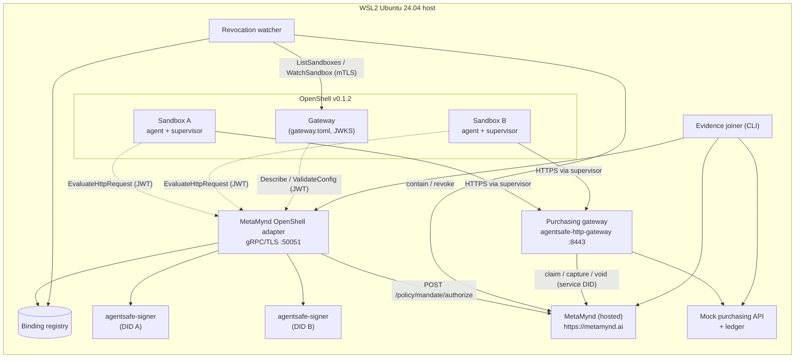
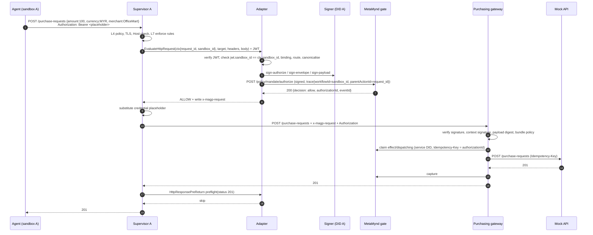

# Design: MetaMynd OpenShell adapter

**Status:** Draft 1 · 29 September 2026
**Scope reference:** [POC scope v0.3](../MetaMynd_OpenShell_Integration_POC_Scope_v0.3.md)
**Pinned versions:** OpenShell `v0.1.2` (`6648bd0c`). MetaMynd packages `@metamynd/agentsafe-guard@0.17.x`, `@metamynd/agentsafe-http-gateway@0.15.x`, `@metamynd/agentsafe-mcp-guard@0.17.x` and `@metamynd/agentsafe-signer@0.19.x`, plus the hosted MetaMynd service at `https://metamynd.ai` (release recorded in `versions.lock`).

## 1. Goals and non-goals

**Goals**

1. Every state-changing request from an OpenShell sandbox to the protected purchasing API is authorized by MetaMynd before it leaves the supervisor, under the identity of the agent bound to that sandbox.
2. The purchasing system executes only requests that MetaMynd authorized, with the exact bytes that were authorized, at most once.
3. One adapter instance serves many sandboxes with no cross-sandbox leakage of identity, decisions or keys.
4. Every outage along the path fails closed.
5. An operator can join one purchase across OpenShell OCSF, the adapter log, the MetaMynd decision record and the purchasing ledger.

**Non-goals (POC)**

- Multiple agents in one sandbox. OpenShell identity is per sandbox.
- WebSocket, streaming or non-HTTP protocols to the protected API.
- Hosted, Kubernetes or high-availability deployment.
- Holding an escalated request open inside OpenShell. Escalation resolves by approve-then-retry (§5.4).
- Changes to OpenShell or to MetaMynd packages. We use released extension points and published APIs only.

## 2. System context



## 3. Components

### 3.1 Adapter (`packages/adapter`)

A Node.js 22 (ESM) gRPC server that implements two services from the pinned protos: `openshell.middleware.v1.SupervisorMiddleware` and `openshell.middleware.v1.HttpResponsePreReturn`. The internal modules run in pipeline order:

| Module | Responsibility |
| --- | --- |
| `server` | gRPC over TLS (`@grpc/grpc-js`, `@grpc/proto-loader` against `proto/v0.1.2/*.proto`). Message limit ≥ 4 MiB + 512 KiB. Graceful shutdown. |
| `describe` | Returns the manifest: `extension` `PeerMetadata` (protocol 1.x, capability `openshell.supervisor-middleware.contract`), `expected_audience`, and two bindings: `HTTP_REQUEST/PRE_CREDENTIALS` and `HTTP_RESPONSE/PRE_RETURN`, each with `max_payload_bytes = 1 MiB`. It validates the gateway's `PeerMetadata` and rejects an unsupported major version. |
| `auth` | Verifies the gateway JWT on every RPC (§6.1). Returns an `AuthContext {callerKind, sandboxId, gatewayId}`. |
| `config` | `ValidateConfig`: strict schema for the policy `config` Struct (§4.3). It rejects unknown keys. |
| `binding` | `sandbox_id` → `Binding` lookup from the registry (§4.4). A missing, revoked or generation-mismatched binding is denied. |
| `route` | Matches `(host, port, method, path)` to a route from `routes.json` (§4.2), deny-by-default. Returns the pinned `action` and the field rules. |
| `canon` | Rejects any request `content-encoding`, a non-JSON `content-type`, oversize bodies and duplicate or conflicting headers. Parses the body with the gateway's `parseStrictJson`, enforces `allowedFields` and `valueFields`, and extracts `{amount, currency, merchant, resource}`. |
| `signer` | One cached `agentsafe-guard` instance per binding, created with `createGuard({ api, agentDid, keyProvider: 'daemon', daemonSocketPath })`. It calls `buildSignedRequest({ action, amount, currency, merchant, resource, context, trace, payload })` with `payload` = the parsed body and `context` = `{ riskLevel }` taken from the matched route (§4.2). That call produces `payloadDigest`/`payloadSignature` and `envelopeSignature`. |
| `gate` | `POST {MM_API}/policy/mandate/authorize` with the signed request and a hard deadline (§5.3). It classifies the response into `Verdict {permit, decision, reasonCode, authorizationId, eventId, escalationId, envelopeId}`. Only HTTP 200 with `allow` or `observe` is a permit. |
| `decide` | Builds `HttpRequestResult`. A permit gives `ALLOW` plus a header mutation `x-magp-request` (overwrite) = JSON of `{...signed, authorizationId}`. Anything else gives `DENY` plus a mapped `reason_code` (§4.5). It never replaces the body. |
| `response` | `HttpResponsePreReturn.Evaluate`: at preflight it records `status_code` against `request_id` and returns `skip`. It never blocks. It ignores later events. |
| `journal` | Append-only JSONL decision journal (§4.6), fsynced per record. This is the bridge for correlating evidence. |
| `escalation` (stretch) | Stores `(sandbox_id, payloadDigest)` → `escalationId`. When an identical request is retried, it polls the escalation status and uses the approved `authorizationId` (§5.4). |

The adapter holds no upstream API credential and no MetaMynd session. Its only authority is reaching the signer sockets. That makes it the most sensitive process in the system: it runs as a dedicated user, and the socket ACLs admit only that user.

### 3.2 Binding registry (`packages/registry`)

A single-writer JSON document at `state/bindings.json`, replaced atomically (write to a temp file, fsync, rename). The adapter loads it read-only and reloads it on `fs.watch` or every 2 s, whichever comes first. A reload that fails validation keeps the last good copy and logs an error. Writers are the enrolment CLI and the revocation watcher, serialised by a lock file. The design allows a later swap for Postgres without changing the adapter's `binding` interface.

### 3.3 Key custody

There is one `agentsafe-signer` daemon per agent DID, role `agent`. Each runs under the adapter's service user on Linux Tier 1, and its socket lives in `state/signers/<didHash>/` with mode `0700` on the directory and `0600` on the socket.

- Keys are generated by the daemon admin socket (`generate-key`) and enrolled as BYOK with `verify-key`.
- The key never leaves the daemon.
- Sandbox containers have no mount or route to `state/`.

### 3.4 Revocation watcher (`packages/watcher`)

A long-running process authenticated to the OpenShell gateway with an mTLS client bundle. It polls `ListSandboxes` every 5 s with label selector `metamynd.io/managed=true`, and holds one `WatchSandbox` stream per bound sandbox.

- **Triggers:** the phase becomes `DELETING`, the stream ends with `NOT_FOUND`, or a listed sandbox's `metadata.id` changes under the same name.
- **Action:** mark the binding `revoked` and increment its generation. When `revokeOnDelete` is set, it also calls MetaMynd `POST /agent-identity/:ref/contain {status:'suspended'}`.
- **Lost state:** if a stream cursor is rejected with `OUT_OF_RANGE` (a gateway restart), it re-lists and re-subscribes.

### 3.5 Purchasing gateway (`packages/purchasing-gateway`)

This is `@metamynd/agentsafe-http-gateway` used as published: `createHttpGateway` driven by `createMcpGuard`, with a small `server.mjs` wrapper. Configuration:

- `requireAuthorization: true`
- `requirePayloadBinding: true`
- `requireContextSignature: true`
- `denyByDefault: true`
- a pinned `policyPublicKey`
- the service identity `service.metamynd.json`, which must be a registered counterparty
- `releaseOnStatus: [400, 409, 422]`

Routes mirror the adapter's `routes.json` for this host.

Before any governance check, the wrapper also requires `Authorization: Bearer <PURCHASING_API_TOKEN>`. OpenShell substitutes that token from the `purchasing-api` provider after the middleware chain. This makes secret isolation testable: the sandbox holds only the placeholder, yet the call succeeds.

Because it verifies the agent signature, the payload digest and the single-use claim independently, it is the second enforcement point. It is also the component that settles the hold.

### 3.6 Mock purchasing API (`packages/mock-purchasing`)

A Fastify service with these endpoints:
- `POST /purchase-requests` → `201 {id}`. It writes to a SQLite ledger keyed by `Idempotency-Key`, which the gateway sets to `authorizationId`.
- `GET /purchase-requests/:id`.
- `GET /ledger` (operator only).

It refuses `Upgrade` with `400`, and it never echoes request headers. It listens only on the gateway's loopback or container network. The gateway reaches it over plain HTTP on a private network; the sandbox-facing TLS endpoint is the purchasing gateway.

### 3.7 Tooling

- **`tools/enrol`**: a CLI that creates the principal, both agents (BYOK through the signer daemons), mandates, a SOP, the counterparty registration and bindings. It follows `backend/scripts/demo-mandate.ts`.
- **`tools/evidence`**: a CLI that joins the four sources for a time window and emits a report (§7).
- **`tools/matrix`**: the scripted adversarial matrix. Scripts run inside the sandboxes through `openshell sandbox exec` or SSH, and assertions read the ledger, the journal and OCSF.
- **`agent/`**: a minimal procurement agent image. A Python script with an optional LLM loop; it is deterministic for the matrix.

## 4. Interfaces and data

### 4.1 OpenShell gateway registration (`deploy/openshell/gateway.toml` fragment)

```toml
[gateway_jwt]
ttl_secs = 900

[[openshell.supervisor.middleware]]
name              = "metamynd"
grpc_endpoint     = "https://127.0.0.1:50051"
tls_ca_cert_path  = "/etc/openshell/certs/metamynd-poc-ca.pem"
audience          = "urn:openshell:extension:middleware:metamynd"
max_payload_bytes = 1048576
timeout           = "5s"
```

### 4.2 Sandbox policy and adapter routes

```yaml
# deploy/openshell/policy.agent.yaml
version: 1
network_policies:
  purchasing:
    endpoints:
      - host: host.openshell.internal
        port: 8443
        protocol: rest
        enforcement: enforce
        rules:
          - allow: { method: GET,  path: "/purchase-requests/**" }
          - allow: { method: POST, path: "/purchase-requests" }
        credential_binding: { provider: purchasing-api }
    binaries:
      - path: /usr/bin/python3.12
network_middlewares:
  metamynd:
    middleware: metamynd
    order: 2147483647          # always last; the stretch interceptor enforces this
    on_error: fail_closed
    config: { routes: "purchasing-v1", mode: "enforce" }
    endpoints: { include: ["host.openshell.internal"] }
```

```json
// packages/adapter/routes/purchasing-v1.json
[
  { "host": "host.openshell.internal", "port": 8443, "method": "POST", "path": "/purchase-requests",
    "action": "office_supplies.purchase",
    "valueFields": ["amount", "currency", "merchant"],
    "allowedFields": ["amount", "currency", "merchant", "items", "note"],
    "riskLevel": "low",
    "resourceFrom": null },
  { "host": "host.openshell.internal", "port": 8443, "method": "GET", "path": "/purchase-requests/*",
    "action": null }
]
```

A route with `"action": null` is read-only: the adapter allows it without calling MetaMynd and journals it as `passthrough`. An unmatched `(host, port, method, path)` is denied with `metamynd_route_not_allowed`.

Every governed route must set `riskLevel` (`low` | `medium` | `high` | `critical`). The adapter sends it as `context.riskLevel`, and the agent's request can never supply it.

This is required because metamynd.ai enforces the EU AI Act Standard, whose risk rule escalates any request without a well-formed `riskLevel` as `CONTEXT_UNVERIFIABLE`. Spike S5 observed this on production: all 20 allowed-class probes escalated until the field was added.

The value is signed by `envelopeSignature`. At the gate its provenance is still "agent claim", because the adapter signs as the agent, so an owner who wants a hard floor sets the mandate's `riskTier`.

### 4.3 Policy `config` Struct (validated by `ValidateConfig`)

| Key | Type | Rule |
| --- | --- | --- |
| `routes` | string | Must name a route file shipped with the adapter. |
| `mode` | `"enforce"` \| `"shadow"` | `shadow` journals the decision and always allows. It is rejected unless `ADAPTER_ALLOW_SHADOW=1`. |

Any other key makes the config invalid. Because the config is authored in sandbox policy, it can only choose among operator-shipped route sets. It can never supply routes, keys or identities.

### 4.4 Binding record

```json
{
  "sandboxId": "0b6f…-uuid",
  "workspace": "default",
  "sandboxName": "agent-a",
  "agentDid": "did:hedera:testnet:z…_0.0.123",
  "agentIdentityRef": "…",
  "mandateRef": "…",
  "signerSocket": "state/signers/3f2a…/agent.sock",
  "generation": 1,
  "status": "active",
  "createdAt": "2026-10-01T02:00:00Z",
  "revokedAt": null
}
```

`sandboxId` is the primary key. `generation` increments on every revocation or rebind. The adapter includes `generation` in the journal.

### 4.5 Reason-code mapping

OpenShell requires `^[a-z][a-z0-9_]{0,63}$`. MetaMynd codes are mapped as `metamynd_` + the lowercased code, with any character outside `[a-z0-9_]` replaced by `_` and the result truncated to 64 bytes. For example, `CONSTRAINT_FAILED:mm:merchant` becomes `metamynd_constraint_failed_mm_merchant`.

Codes the adapter generates itself:

| Condition | `reason_code` |
| --- | --- |
| No route matched | `metamynd_route_not_allowed` |
| Unknown, revoked or stale binding | `metamynd_binding_unknown` |
| JWT invalid, or JWT sandbox differs from the context | `metamynd_caller_unauthenticated` |
| Encoding, content-type, size, parse or field violation | `metamynd_request_rejected` |
| Signer unreachable or refused | `metamynd_signer_unavailable` |
| Gate timeout, 5xx or response without a verdict shape | `metamynd_unavailable` |
| MetaMynd escalate | `metamynd_escalation_pending` |

The free-text `reason` is always a short diagnostic that contains no request content.

### 4.6 Decision journal record (`state/journal/YYYY-MM-DD.jsonl`)

```json
{ "ts": "…", "kind": "request", "requestId": "…", "sandboxId": "…", "generation": 1,
  "agentDid": "…", "route": "POST /purchase-requests", "action": "office_supplies.purchase",
  "amount": "100", "currency": "MYR", "merchant": "OfficeMart", "payloadDigest": "sha256:…",
  "nonce": "…", "envelopeId": "env:…", "decision": "allow", "reasonCode": "AUTHORIZED",
  "authorizationId": "…", "eventId": "…", "escalationId": null, "osReasonCode": null,
  "latencyMs": { "canon": 1, "sign": 4, "gate": 180, "total": 190 } }
{ "ts": "…", "kind": "response", "requestId": "…", "sandboxId": "…", "statusCode": 201 }
```

The journal never records header values, bodies or keys. Amounts are recorded because they are the governed fields; `note` and `items` are not.

### 4.7 Header contract to the purchasing gateway

- **Header:** `x-magp-request`, JSON, the default extractor of `agentsafe-http-gateway`.
- **Contents:** the output of `buildSignedRequest` plus `authorizationId`.
- **Size:** about 1.5–3 KiB, well under OpenShell's 64 KiB header budget.

`x-magp-request` is not an OpenShell-protected header, so later stages could remove or alter it. If they do, the purchasing gateway refuses the request (`MISSING_GOVERNANCE`, signature or digest mismatch, or `AUTHORIZATION_*`). Tampering therefore fails closed.

## 5. Request flows

### 5.1 Allowed purchase



### 5.2 Denied purchase

Steps 1–6 are the same as §5.1. The gate returns 403 `{decision: block, reasonCode: SPEND_LIMIT_EXCEEDED}`. The adapter returns `DENY` with `reason_code = metamynd_spend_limit_exceeded`, and the sandbox receives a 403 `{error: "middleware_denied", middleware: "metamynd", reason_code}`. No hold is created, and nothing reaches the purchasing gateway.

### 5.3 Deadlines and failure handling

- The registration `timeout` is 5 s. The adapter's internal budget is 4.5 s, split as: sign ≤ 300 ms, gate ≤ 4 s, and the remainder for canonicalisation and response.
  - Spike S5 measured the path from COO-JASIM-NB1 to metamynd.ai: allow p50 1.21 s, p95 1.57 s, max 1.57 s; deny p50 0.41 s, p95 0.93 s.
  - The 4 s gate deadline is about 2.5 times the observed allow p95.
- If the adapter exceeds 5 s, OpenShell applies `fail_closed`.
- Every exception, non-200 gate response, verdict without a recognised shape or signer error maps to a deny code (§4.5). The adapter never returns `ALLOW` from an error path. This is enforced by a single `decide(verdict)` function with exhaustive tests.
- **Orphaned holds:** an allowed request can mint a hold that never reaches the purchasing gateway. This happens when a later stage denies it, the sandbox disconnects, or the upstream fails before the claim. An unclaimed hold lapses after 15 min and consumes cap until then. The optional sweeper (M4) voids unclaimed holds older than 60 s. If a void races a late claim, the claim is refused and the purchase fails closed.

### 5.4 Escalation (stretch)

1. The gate returns `escalate`. The adapter denies with `metamynd_escalation_pending` and stores `(sandboxId, payloadDigest) → escalationId`.
2. The reviewer approves in the MetaMynd dashboard.
3. The agent retries the same request. The adapter finds the entry and calls `GET /policy/escalations/:id/status`.
   - **Approved:** the adapter uses the returned `authorizationId`. It re-signs so the purchasing gateway has a fresh signed request carrying that `authorizationId`, and returns `ALLOW`.
   - **Pending:** the adapter denies again with the same code.
   - **Denied or expired:** the adapter denies with the mapped code.
4. Before building this, check whether the purchasing gateway accepts a signed request whose nonce differs from the one that created the escalation. If it doesn't, fall back to the agent re-issuing after approval with a fresh authorize, which an approved-escalation SOP exemption would then allow. Resolve this in M4.

## 6. Security design

### 6.1 Call authentication (adapter)

- Pin the gateway ID (`iss = openshell-gateway:<id>`) and the Ed25519 public key. Load them from `GET https://<gateway>/.well-known/jwks.json` at enrolment time, store them in `state/gateway-trust.json`, and refresh over TLS only when the `kid` changes and the new key is fetched from the pinned origin.
- Per call, require:
  - `alg=EdDSA`, `typ=openshell-ext+jwt`, and `aud` equal to the configured audience;
  - `exp` in the future, with 30 s leeway;
  - for `Describe` and `ValidateConfig`: `caller_kind=gateway`;
  - for evaluation RPCs: `caller_kind=supervisor` and `jwt.sandbox_id == RequestContext.sandbox_id`.
- Do not reject a reused `jti`.

### 6.2 Threat model (POC)

| Threat | Mitigation | Residual |
| --- | --- | --- |
| The agent forges its identity via header or body | Identity comes only from the JWT-attested `sandbox_id` → registry | None known |
| The agent reaches the API without the middleware | Kernel egress capture. The API host is reachable only through `host.openshell.internal:8443`. The purchasing gateway demands a claimable `authorizationId` | Policy-hygiene rules (no `tls: skip`, `protocol: tcp` or hostless `allowed_ips`) are checked by a lint script and the stretch interceptor |
| A later middleware stage rewrites the body | The adapter is the highest `order`. `payloadDigest` is bound and re-checked by the purchasing gateway | A policy author can reorder stages. The claim then fails closed |
| A captured `x-magp-request` is replayed | The claim is single-use (`AUTHORIZATION_ALREADY_CLAIMED`) and the nonce is single-use at the gate | None |
| A stolen gateway JWT is replayed to the adapter | TLS to the adapter; tokens live ≤ 15 min; the adapter listens only on the WSL host interface | Bearer token with no channel binding (upstream feature request) |
| A sandbox reaches a signer socket | Sockets are under `state/` with no mount and no network route. The daemon trusts OS ACLs only | Compromise of the adapter's user equals compromise of all bound agents' signing authority (documented) |
| A deleted sandbox's binding is reused | Primary key is `sandboxId`; a recreate yields a new UUID; the watcher revokes | Watcher lag of ≤ 5 s poll interval (measured in the matrix) |
| A secret leaks into the sandbox | Provider placeholder, substituted after the chain; the API never echoes | None known |
| MetaMynd is down | The adapter denies (`metamynd_unavailable`) | Availability coupling is by design |
| The adapter is down | OpenShell `fail_closed`. The gateway refuses to start without the adapter | Operational: start the adapter before the gateway |

## 7. Evidence and correlation

The join keys, in order:

1. OpenShell OCSF `HttpActivity` (`container.uid` = `sandbox_id`, URL, `status_detail`, time).
2. Adapter journal (`sandboxId` + route + time ±2 s → `requestId`).
3. MetaMynd `decision_record` (`trace.parentActionId = requestId`, `envelope_id = env:<nonce>`).
4. `evidence_event` (`decision_digest`) → Merkle proof (`GET /magp/evidence/:eventId/proof`).
5. Ledger (`Idempotency-Key = authorizationId`).

`tools/evidence` produces one row per purchase with every ID plus a `joined: full | partial(<missing>)` status. OCSF events carry no `request_id`, so step 1→2 is a time-window join. The report states this and counts ambiguous matches.

## 8. Deployment topology (local)

| Process | Where | Port / socket | Notes |
| --- | --- | --- | --- |
| MetaMynd | Hosted, `https://metamynd.ai/api/v1` | 443 | Dedicated POC tenant with testnet agents. MetaMynd holds the Hedera operator account; nothing in the POC talks to Hedera directly |
| OpenShell gateway | WSL2 (installer, systemd user service) | 17670 (mTLS) | Pinned `OPENSHELL_VERSION=v0.1.2` |
| Adapter | WSL2 host process, user `mmadapter` | 50051 (TLS) | Bound to `127.0.0.1:50051`. Supervisors use host networking, and the gateway does not resolve `host.openshell.internal`, so the registration uses the IP (spike S2) |
| Signer daemons | WSL2, user `mmadapter` | UNIX sockets in `state/signers/` | One per DID |
| Watcher | WSL2 host process | none | mTLS bundle from `~/.config/openshell/gateways/<name>/mtls/` |
| Purchasing gateway | WSL2 host process, `127.0.0.1:8443` | 8443 (TLS) | Addressed as `host.openshell.internal`, the only policy host OpenShell pins to loopback. Its certificate is from the POC CA, with SAN `DNS:host.openshell.internal`. Supervisors trust that CA through the derived image `local/openshell-supervisor:0.1.2-pca` (spike S3) |
| Mock purchasing API | Same docker network | 8080 (HTTP, internal only) | |
| Sandboxes A, B | OpenShell docker driver | none | Custom agent image; provider `purchasing-api` |

## 9. Repository layout

```
openshell-integration/
├─ docs/                   design.md, build-plan.md, runbook.md, report/ (M5)
├─ proto/v0.1.2/           vendored supervisor_middleware.proto, extension.proto (+ LICENSE notice)
├─ packages/
│  ├─ adapter/             gRPC middleware (src/, routes/, test/)
│  ├─ registry/            binding store + lock + schema
│  ├─ watcher/             sandbox lifecycle → revocation
│  ├─ purchasing-gateway/  agentsafe-http-gateway wrapper + service identity
│  └─ mock-purchasing/     Fastify API + SQLite ledger
├─ agent/                  procurement agent image (Dockerfile, agent.py)
├─ deploy/                 openshell/ (gateway.toml, policies, provider profile), compose.yaml, certs/ (scripts only)
├─ tools/                  enrol/, evidence/, matrix/, policy-lint/
├─ versions.lock           pinned OpenShell tag, image digests, MetaMynd commit, package versions
└─ .github/workflows/ci.yml   lint, unit, proto-contract tests
```

The toolchain is an npm workspaces monorepo on Node 22, with `node:test` and TypeScript type checking via JSDoc (`tsc --checkJs`). This keeps the adapter importable by the zero-dependency MetaMynd ESM packages.

## 10. Testing strategy

| Level | What | How |
| --- | --- | --- |
| Unit | Canonicalisation (fuzz with the gateway's `bind-payload.fuzz` corpus), JWT verifier (vectors: wrong `aud`/`typ`/`alg`, expired, sandbox mismatch, gateway caller on evaluate), reason mapping, `decide()` exhaustiveness, registry reload | `node:test` |
| Contract | Adapter against the pinned proto: Describe negotiation, limits, reason-code regex, header-mutation validity | In-process gRPC client using the same `.proto` files; golden messages |
| Component | Adapter + fake gate + real signer daemon; purchasing gateway + fake MetaMynd | Docker compose `test` profile |
| System | Full stack on WSL2, both sandboxes | `tools/matrix` (scope v0.3 §3, run in both modes) |
| Performance | p50/p95/p99 for three paths, ≥100 calls each | `tools/matrix perf` |

CI runs unit and contract tests on every PR. System tests run manually on the WSL2 host and their outputs are committed under `docs/report/runs/`.

## 11. Spikes and open questions (resolve in M0)

| ID | Question | Default if unresolved |
| --- | --- | --- |
| S1 | Does the WSL2 kernel pass OpenShell's Landlock ABI 3 and seccomp checks? | **Closed:** kernel 6.18 with Landlock ABI 7 passes (runbook step 0.2) |
| S2 | Can supervisors (Docker driver) reach a host-local middleware, and does TLS with a private CA work? | **Closed:** `https://127.0.0.1:50051` works for both the gateway and supervisors, and the gateway ships the pinned CA (runbook step 0.4) |
| S3 | How does the supervisor trust the purchasing gateway's private CA? Upstream roots come from the **supervisor image's** system bundle. | **Closed:** a derived `local/openshell-supervisor:0.1.2-pca` image (stock bundle + POC CA), set through `[openshell.drivers.docker] supervisor_image`, verifies `host.openshell.internal:8443`. Plain HTTP also works as a fallback (runbook step 0.5) |
| S4 | Does `agentsafe-http-gateway` accept the adapter-built `x-magp-request` unchanged (the `authorizationId` field, the context-signature default)? | Build the header with `metamynd-client`'s `SignedRequest.headers()` shape |
| S5 | What is the MetaMynd authorize latency from the POC host? It drives the middleware timeout. | **Closed:** allow p95 1.57 s against metamynd.ai; timeout set to 5 s, with a 4 s gate deadline (§5.3) |
| S6 | Can a provider placeholder in `Authorization` reach the purchasing gateway intact after substitution while `x-magp-request` survives? | **Half closed:** substitution of a bound bearer placeholder is proven (runbook step 0.5). Whether `x-magp-request` survives is checked in M3. Fallback: carry the upstream credential through the Credential Vault (`resolveCredential`) |
