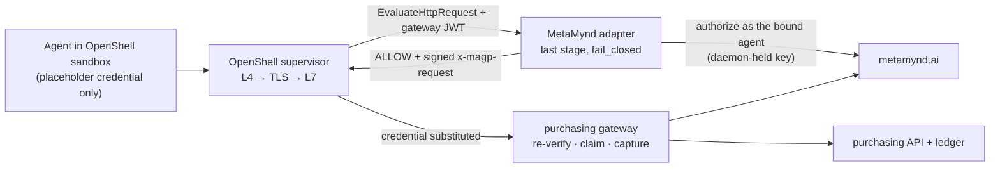

# MetaMynd × NVIDIA OpenShell: integration report

**Date:** 29 September 2026
**Scope:** [POC scope v0.3](../../MetaMynd_OpenShell_Integration_POC_Scope_v0.3.md) · [design](../design.md) · [build plan](../build-plan.md) · [runbook with every run's raw results](../runbook.md)
**Status:** POC complete through M5 on one host. One review step, the independent threat review (task 4.7), is still open and needs a second person.

This report describes a proof of concept built by MetaMynd on released, public extension points. It is not a claim of partnership, endorsement or a completed product integration.

## Summary

MetaMynd's authorization runs as an OpenShell v0.1.2 **supervisor middleware**. Every state-changing request from a sandboxed agent to a protected purchasing API is handled in this order:
1. The adapter judges it at metamynd.ai as the agent bound to that sandbox.
2. OpenShell substitutes the upstream credential.
3. MetaMynd's purchasing gateway re-verifies and settles it.
4. The purchasing API executes it exactly once.

**Results against the scope's gates:**

- **Technical pass: met.**
  - Every intended purchase executed once.
  - Zero unauthorized ledger writes across a 22-row adversarial matrix, run in both modes.
  - Every tested outage failed closed.
  - Two agent identities ran through one adapter with no cross-attribution.
  - The upstream secret never reached the sandbox or the adapter, and no agent key, signer socket or signer variable was visible from inside a sandbox.
  - The same controls held from a second client (Python) as from curl.
  - Nothing was forked; OpenShell `v0.1.2` and published MetaMynd packages were used as released.
- **Product pass: met.** MetaMynd enforced what OpenShell alone cannot express: live mandates with merchant and spend rules, human-approval escalation, a behavioural spend-anomaly floor, per-agent identity, and anchored evidence. OpenShell enforced what MetaMynd alone cannot: kernel-level egress capture regardless of client (shell, raw TCP, IP, port), credential isolation, and bypass resistance. Both decisions appear in one joined trace.
- **Collaboration pass: ready.** There is a public-safe repository with synthetic data, supported extension points only, measured latency, and seven upstream issue drafts ([upstream/](upstream/)), one of them a reproducible bug.

**Recommendation:** proceed to a public reference example and an upstream conversation with the OpenShell maintainers, led by the reload bug and the correlation-ID request. Keep deployment claims scoped to what was measured: one host, one protected HTTPS API, and WSL2, which OpenShell lists as experimental.

## What was built

| Component | What it does | Where |
| --- | --- | --- |
| MetaMynd OpenShell adapter | Verifies OpenShell's gateway-signed JWT and binds `jwt.sandbox_id` to the request context. Maps `sandbox_id` to an agent through an operator registry, matches routes, and canonicalises strictly. Authorizes at metamynd.ai as the bound agent with its `agentsafe-signer` daemon key. On a permit it writes a freshly signed `x-magp-request`. It journals every decision and fails closed on every error | `packages/adapter` |
| Revocation watcher | Revokes a binding when its sandbox disappears. Bindings are keyed by UUID, so a recreated sandbox never inherits one | `packages/adapter/bin/watcher.mjs` |
| Purchasing gateway | `agentsafe-http-gateway` and `agentsafe-mcp-guard` over TLS. Checks the upstream bearer first, then MetaMynd re-verification (signature, context signature, payload binding), a single-use claim, and capture or release | `packages/purchasing-gateway` |
| Mock purchasing API | An idempotent ledger with one row per `authorizationId` | `packages/mock-purchasing` |
| Enrolment and tooling | BYOK testnet agents with daemon-held keys, counterparty registration, the stack, the matrix, evidence and latency harnesses | `packages/poc-cli`, `tools/` |

**Versions:** OpenShell `v0.1.2` (`6648bd0c`). MetaMynd `metamynd.ai` release `v1.71.0` (latency re-measured on `v1.72.0`). `@metamynd/agentsafe-guard@0.17.0`, `agentsafe-http-gateway@0.15.0` (0.16.0 from 30 Sep 2026), `agentsafe-mcp-guard@0.17.1`, `agentsafe-signer@0.19.1`. Host: Windows 11 with WSL2 Ubuntu 24.04, kernel 6.18, Docker Engine 29.8.1, Node 24 (see `versions.lock`).

## Results

### Governed purchases (M1 native, M3 through OpenShell)

- **Execution:** agent A's purchase through OpenShell executed once, and the ledger grew by exactly 1.
- **Cross-agent use:** agent B's identical request was denied (`metamynd_merchant_not_allowed`), and B's own purchase at PaperCo executed.
- **Rules:**
  - over the RM500 cap → `metamynd_sop_spend_cap`;
  - over RM300 → human escalation;
  - an amount far above the agent's recent history → escalation by MetaMynd's spend-anomaly floor.
- **Secret isolation:** the sandbox held only `openshell:resolve:env:…`; the real token never appeared in the sandbox, the adapter journal or the adapter log.
- **Concurrency:** across every concurrent burst, ledger rows equalled the 201 responses exactly, with no cross-attribution across 26 journaled decisions.

### Adversarial matrix (M4, 22 rows, run with the purchasing gateway enforcing and in verify-only)

| Row | Attack or case | Result, both modes |
| --- | --- | --- |
| R2–R4 | Over cap; merchant outside the mandate; cross-agent request | Denied, no ledger row |
| R5–R6 | Another agent's DID in the body; a forged `x-magp-request` | Rejected, or judged as the sandbox's own agent |
| R7 | Raw TCP from a shell (`/dev/tcp`) | Refused (binary not in policy) |
| R8–R10 | Gateway by IP literal; purchasing API port; an L7-disallowed method | Blocked |
| R11–R12 | gzip body; WebSocket upgrade | Rejected, no ledger row |
| R13 | Concurrent purchases from two sandboxes | Ledger delta = 201s |
| R14–R16 | Adapter down; MetaMynd unreachable; purchasing gateway down | Fail-closed, no ledger row |
| R17–R18 | Sandbox deleted; recreated under the same name | Binding revoked; new UUID unbound |
| R19–R21 | The same requests from Python instead of curl: allowed, over cap, IP literal | Executed once; denied; blocked |
| R22 | Looking for the agents' keys from inside each sandbox | No signer socket, host `state/` path or signer variable visible |

**In verify-only mode the purchasing gateway performed no MetaMynd checks, and OpenShell plus the adapter alone blocked every attack.**

### Evidence (M5)

All six decisions in the evidence scenario joined across four sources:
1. OpenShell OCSF, by sandbox and time window (OCSF carries no `request_id`);
2. the adapter journal;
3. MetaMynd, with the evidence record, trust-graph evidence path and anchored Merkle inclusion proof;
4. the purchasing ledger, keyed by `authorizationId`.

### Latency (M5, 100 sequential purchases per path)

Measured on 30 Sep 2026 against metamynd.ai `v1.72.0`, which made MetaMynd's decision path asynchronous. The first run (29 Sep, `v1.71.0`) is shown for comparison.

| Path | p50 | p95 | p99 | p50 on `v1.71.0` |
| --- | --- | --- | --- | --- |
| OpenShell only | 50 ms | 78 ms | 100 ms | 47 ms |
| MetaMynd only | 1308 ms | 1440 ms | 1512 ms | 2873 ms |
| Combined | 1410 ms | 1868 ms | 2309 ms | 3024 ms |
| Authorize alone, allow (20 calls) | 358 ms | 643 ms | – | 1213 ms |

OpenShell adds about 50 ms and the adapter about 50 ms. An approval now costs about the same as a refusal (358 ms against 339 ms), and authorize's p95 leaves wide headroom under the adapter's 4 s deadline. Most of the remaining time is the purchasing gateway's claim and capture calls to metamynd.ai, which the published `agentsafe-http-gateway@0.15.0` still makes one after the other.

## Findings

### OpenShell (v0.1.2)

1. **A sandbox's first provider-credential use triggers a reload that drops in-flight requests.** Each sandbox reloads its provider environment once (`provider_env_changed:true`, `policy_changed:false`). The reload closes every in-flight L7 tunnel with an empty reply, including requests still inside middleware evaluation. `openshell sandbox exec --env` triggers the same reload.
   - Safety held throughout.
   - Availability of a sandbox's first burst dropped to 0–4/10, and recovered to 10/10 after a warm-up.
   - A second binary's first use of the credential triggers it again: Python's first purchase, after curl had already used the credential, got an empty reply in 2 of 4 runs. A warm-up must cover every binary.
   - [Draft bug report](upstream/01-first-credential-reload-drops-inflight.md).
2. **Middleware OCSF events carry no `request_id`**, so correlation needs the middleware's own journal and a time-window join. [Draft](upstream/02-request-id-in-middleware-ocsf.md).
3. **The response hook does not fire when the upstream fails**, so a middleware cannot learn every outcome. Settlement was moved to the counterparty gateway. [Draft](upstream/03-completion-notification-hook.md).
4. **Later middleware stages can modify a request after an earlier stage allowed it**, and the order is policy-controlled. The POC mitigates this by running last plus payload binding, and by linting policy. [Draft](upstream/04-pin-final-middleware-stage.md).
5. **There is no get-by-id or fleet-wide watch RPC**, so the watcher polls the sandbox list. [Draft](upstream/05-sandbox-lifecycle-watch.md).
6. **There is no private upstream CA setting for the Docker driver**, so we used a derived supervisor image. [Draft](upstream/06-private-upstream-ca-docker.md).
7. **The prover returns `unsupported` for any policy with middleware.** [Draft](upstream/07-prover-opaque-middleware.md).
8. Smaller notes:
   - `host.openshell.internal` is the only way to reach a host-loopback service.
   - `enforcement` defaults to `audit`.
   - A provider profile with `auth_style: bearer` also needs `header_name`.
   - The default workload image has no `curl`.
   - The gateway itself cannot resolve `host.openshell.internal`, so middleware registrations use `127.0.0.1`.

### MetaMynd

1. **Latency.** On `v1.71.0` the three round trips per purchase (authorize, claim, capture) cost about 1 s each from Malaysia, and a permit cost about 0.8 s more than a deny. `v1.72.0` made the decision path asynchronous: authorize dropped to 358 ms p50, permits now cost the same as denies, and the combined path fell from 3.0 s to 1.4 s p50. The next step is asynchronous capture in `agentsafe-http-gateway`, since the upstream response does not depend on it, then a nearer region.
2. **Availability under bursts.** About 10–15% of calls under 20-way concurrency failed at the network level (`fetch failed`), both at authorize and at claim. Every one failed closed. The cause, client-side or server-side, is not yet diagnosed.
3. **Spend-anomaly floor** (`SPEND_ANOMALY_MODE=on`): it escalates amounts above mean + 4 sd, or 4× a uniform mean, of the agent's last 20 purchases. This is a strong behavioural control, but it needs to be documented for integrators: test traffic at one scale changes what later amounts are allowed.
4. **Identity model.** On the decision path, MetaMynd accepts only the agent DID's own signature. The adapter therefore custodies each sandbox agent's key in `agentsafe-signer`. What the signature proves is *"the supervisor observed this request from sandbox S, and S's bound agent is authorized for it"*. It does not prove the agent's own intent. A formal "supervisor-custodied key" assurance tier would make this explicit.
5. **An `authorize` retried after a lost response is not idempotent.** A new nonce mints a new hold; unclaimed holds lapse after 15 min.

## Limitations

- **Single host.** WSL2 plus Docker, which OpenShell lists as experimental. There was no Kubernetes or hosted deployment.
- **One protected HTTPS API with a JSON body.** WebSocket, streaming, `tls: skip`, `protocol: tcp` and IP-level reachability through other rules are **not** covered. The policy lint flags them.
- **Sample sizes** are local and small (100 per latency path). They are not production figures.
- **The independent threat review (task 4.7) is still open.** Deferred: cleanup of unclaimed holds (MetaMynd lapses them), escalation approve-then-retry, a policy-integrity gateway interceptor, MetaMynd-side mandate revocation in the matrix (it would revoke the enrolled agents), and a later middleware rewriting the body (it needs a second service; the purchasing gateway refuses tampered bodies).
- **The enrolled agents' spend history is now RM1-scale**, so showing an allowed RM100 purchase needs fresh agents.

## Next steps

1. Complete the independent threat review against the matrix and the design's §6.2.
2. With the OpenShell maintainers, starting in GitHub Discussions and subject to the project's vouch process:
   - share the reload reproduction and the `request_id` request;
   - ask whether supervisor middleware is the intended long-term seam for external authorization, and about its path out of research preview.
3. With the MetaMynd team: publish asynchronous capture in `agentsafe-http-gateway`, raise the burst-availability item, document the anomaly floor for integrators, and add an assurance tier for supervisor-custodied keys.
4. Record the five-minute demo below with `tools/demo.sh`.

## Demo (five minutes)

`tools/demo.sh` plays the demo as nine scenes, pausing for Enter between them. It sets up the stack off camera, shows each command and its result in plain language, and never prints DIDs, sandbox UUIDs or the token. [demo-script.md](demo-script.md) has the recording checklist and the narration for each scene:

| # | Scene |
| --- | --- |
| 1 | The question, and two agents in two sandboxes sharing one MetaMynd service |
| 2 | The sandbox holds only a placeholder token; the signing keys are out of reach |
| 3 | A buys at OfficeMart → 201, exactly one ledger row |
| 4 | B sends the identical request → refused (`metamynd_merchant_not_allowed`) |
| 5 | RM600 → over the limit; RM350 → waits in the principal's review queue |
| 6 | RM100 after an RM1 history → anomaly escalation, although every rule allows it |
| 7 | Raw TCP, the gateway by IP, the API port directly, and a Python client |
| 8 | Every decision joined across OpenShell, the journal, MetaMynd's anchored proof and the ledger |
| 9 | What each layer did |

The enrolled agents work as they are: their RM1 history is what makes scene 6 escalate. `DEMO_GW_MODE=verify-only` runs it with the purchasing gateway doing no MetaMynd checks.
